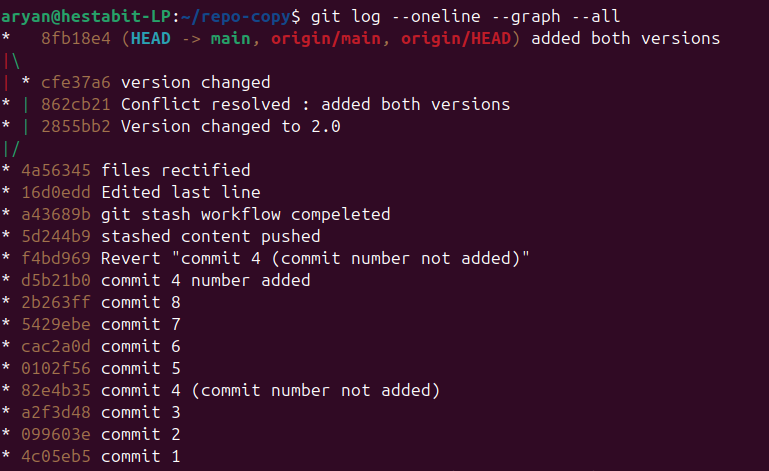

# Merge Conflict Postmortem — Git Mastery Day 3

## Introduction
This document explains an intentional merge conflict created as part of the Development Launchpad Day 3 task. The goal was to understand how Git behaves when the same line in the same file is modified in parallel and how to resolve such conflicts correctly using a merge-based workflow.

---

## Setup
Two separate clones of the same GitHub repository were created:

- Clone 1 made a change to a specific line in "commits.txt"
- Clone 2 made a different change to the **same line** in "commits.txt"
- Both changes were committed independently

This resulted in divergent branch histories.

---

## How the Conflict Occurred
When attempting to pull the latest changes from the remote repository,
Git detected that the local and remote branches had diverged and required
an explicit reconciliation strategy.

Command used:
```bash
git pull --no-rebase origin main
```
Git then reported a merge conflict in the file that was edited in both
clones.

Conflict Details

Git marked the conflicting section in the file using conflict markers,
indicating that it could not automatically decide which change to keep.

As required by the task, both changes were preserved.

The conflict was resolved manually by removing the conflict markers and
keeping both versions in the file:

// version 1.2
// version 2.0

Completing the Merge

After resolving the conflict, the merge was completed using:

```bash
git add commit.txt
git commit -m "Merge conflict resolved: kept both changes"
```

Resolved file staged and committed:


Non-Fast-Forward Push Error

When pushing the merge commit, Git rejected the push with a
non-fast-forward error. This occurred because the remote branch already
contained commits from the other clone.

Error message:

! [rejected] main -> main (non-fast-forward)

Push rejected due to non-fast-forward


## Final Resolution

The issue was resolved by pulling the remote changes again using a merge
strategy and then pushing the updated history.

## Commands used:
```bash
git pull --no-rebase origin main
git push origin main
```

The final commit graph confirms:

Parallel commits from two clones

A merge commit combining both histories

Conflict resolution preserved in history

## Command used:
```bash
git log --oneline --graph --all
```

## Screenshot:


## Conclusion

This exercise demonstrated real-world Git conflict handling using a
merge-based workflow. The conflict was resolved manually while preserving
both changes, and the repository history clearly reflects the merge and
resolution steps. This approach maintains transparency and avoids
rewriting commit history.
